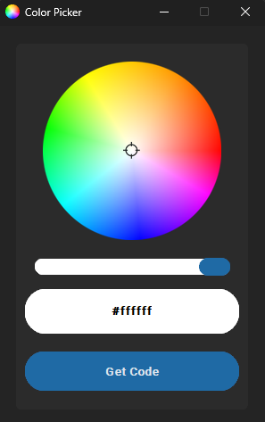

# 🎨 CustomTkinter Color Picker


**A modern and interactive Color Picker built with Python and CustomTkinter, featuring a rotating color wheel, brightness control and instant HEX color copying using [CustomTkinter](https://customtkinter.tomschimansky.com/).**

This tool allows users to visually pick any color from a wheel and copy its HEX code directly to clipboard — ideal for designers, developers and UI/UX creators.


## ⭐ Features

- 🎯 Click & drag color selection on a color wheel
- 🌈 Real-time RGB → HEX conversion
- 🔆 Brightness slider for fine-tuning
- 📋 One-click copy to clipboard
- 🖼️ Smooth image-rendering using Pillow (PIL)
- 🖥️ Modern UI powered by CustomTkinter
- 🧮 Built-in color math and projection logic
- 📌 Always-on-top floating window
- ⚡ Lightweight & fast


## 📦 Installation

### 1️⃣ Clone the repository
```bash
git clone https://github.com/iamx-ariful-islam/CTk-Color-Picker.git
cd CTk-Color-Picker
```

### 2️⃣ Create virtual environment (optional but recommended)
```bash
python -m venv venv
source venv/bin/activate  # Linux/Mac
venv\Scripts\activate     # Windows
```

### 3️⃣ Install dependencies
```bash
pip install -r requirements.txt
# or
sudo pip install -r requirements.txt
```
The `requirements.txt` file, lists of all the python libraries that my "**_CTk Color Picker_**" depends on and installs those packages from the file.


## 📁 Project Structure
Here’s the structure of the **CTk Color Picker** project:

```bash
CTk-Color-Picker/
│
│── icons/
│── screenshots/
│── main.py
│── LICENSE
├── README.md
└── requirements.txt
```

## ▶️ Run the Application
```bash
python main.py
```


## 📸 Sreenshots
Here are some screenshots of the `CTk Color Picker` project:

**CTk Color Picker**<br/>
<br/>


## How it works

- Drag your mouse over the color wheel to pick a color
- Adjust brightness using the bottom slider
- Press Get Code to copy the HEX color to clipboard
- The window stays on top for easy access during design work


## 🤝 Contributing

Contributions, suggestions, and feedback are always welcome! ❤️<br/>
To contribute:

1. Fork the repository
2. Create a new branch (`feature/new-feature`)
3. Commit your changes
4. Push and submit a Pull Request

💬 You can also open an issue if you’d like to discuss a feature or report a bug.


## 🌐 For more or connect with me

<p align='center'>
  <a href="https://github.com/iamx-ariful-islam"></a>&nbsp;&nbsp;&nbsp;&nbsp;
  <a href="https://x.com/mx_ariful_islam"></a>&nbsp;&nbsp;&nbsp;&nbsp;
  <a href="https://bd.linkedin.com/in/iamx-ariful-islam"></a>&nbsp;&nbsp;&nbsp;&nbsp;
  <a href="https://www.facebook.com/jonakisoft.net/"></a>&nbsp;&nbsp;&nbsp;&nbsp;
</p>


## 📜 License

The [MIT](https://choosealicense.com/licenses/mit/) License (MIT)


## 💖 Thank You for Visiting!

> “Good design is about making things simple yet significant”  
> — *Md. Ariful Islam*